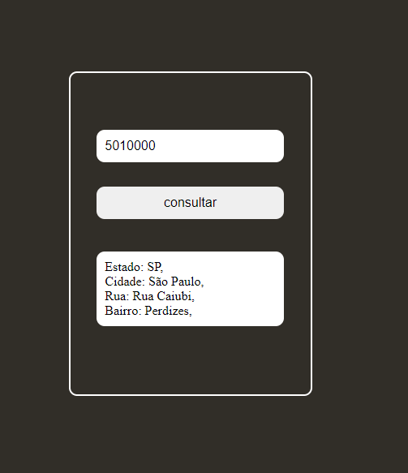

# Buscar cep

utilezei a api do CEP Promise.

url = https://github.com/BrasilAPI/cep-promise



```js
async function buscarCep() {
  const div = document.createElement("div");
  const number = document.querySelector("input").value;
  const box = document.querySelector("div");

  const { state, city, street, neighborhood } = await cep(number);

  div.classList.add("response");

  div.innerHTML = `
  Estado: ${state},<br />
  Cidade: ${city},<br />
  Rua: ${street},<br />
  Bairro: ${neighborhood},<br />
  `;

  box.appendChild(div);
}
```
